# UI Reference Board — FDC Capital Betting Dashboard
> Fase 0 | Screenshots capturadas em: 2026-06-14 | Viewport: 1440×900 | Tema: dark compact

Todas as imagens em: `docs/screenshots/`

---

## MELHORES TELAS

### 🥇 1. Diário (`diario.png`)
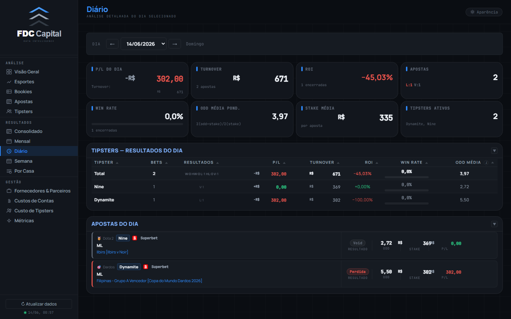

**Por quê é a melhor:**
- 8 KPIs em 2 fileiras de 4 — completamente uniformes em padding, peso tipográfico e hierarquia
- A tabela de tipsters do dia usa alinhamento perfeito (nome esquerda, números direita)
- Os bet-cards no rodapé têm a borda colorida de resultado funcionando com elegância
- Nenhum elemento "sobressai" errado — tudo no mesmo nível de atenção
- **É o padrão de referência para o que os KPI cards devem ser em todo o dashboard**

---

### 🥈 2. Métricas (`metrics.png`)
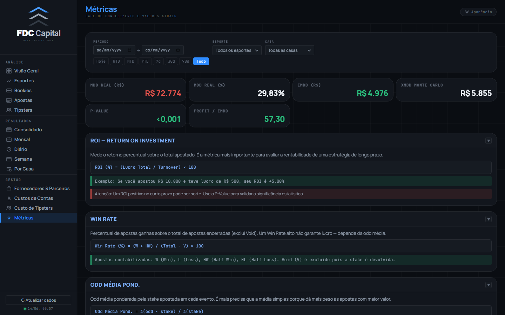

**Por quê é excelente:**
- Os KPI cards de MDD / EMDD / XMDD / P-Value no topo são cirúrgicos — sem adornos, só dado
- A semântica de cor está correta: vermelho = realizado, verde = favorável, branco = neutro
- As seções colapsáveis têm hierarquia clara: título azul → fórmula mono → exemplo verde → aviso vermelho
- O contraste das caixas de fórmula (background escuro, texto mono azul) é legível e elegante
- **Página de maior densidade informacional que ainda respira**

---

### 🥉 3. Por Casa — barras (`resultados_casa.png`)
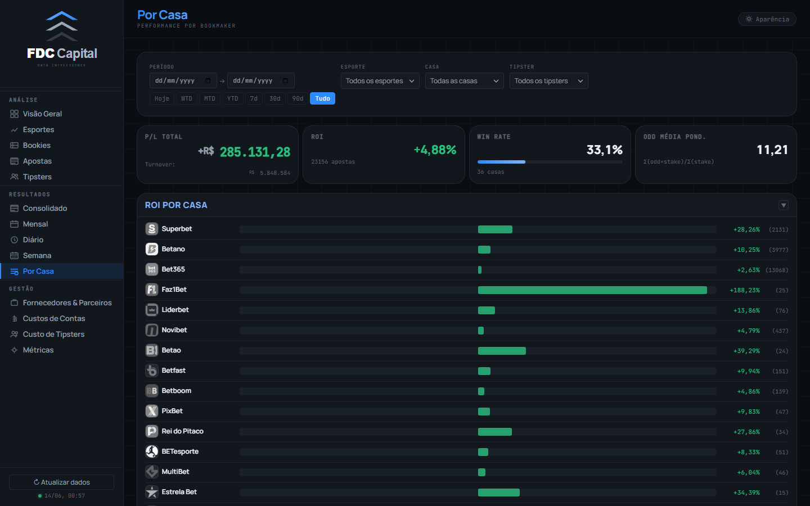

**Por quê se destaca:**
- As barras horizontais com favicon + nome + barra proporcional + valor à direita são o componente mais original do dashboard
- A proporção é perfeita: favicon 24px alinhado ao nome, barra tomando ~70% da largura
- Os 4 KPIs no topo são consistentes com o restante do sistema
- Cor única (verde) para todas as barras positivas — sem ruído
- **Mostra que o dashboard tem capacidade para componentes únicos e sofisticados**

---

### 4. Visão Geral (`overview.png`)
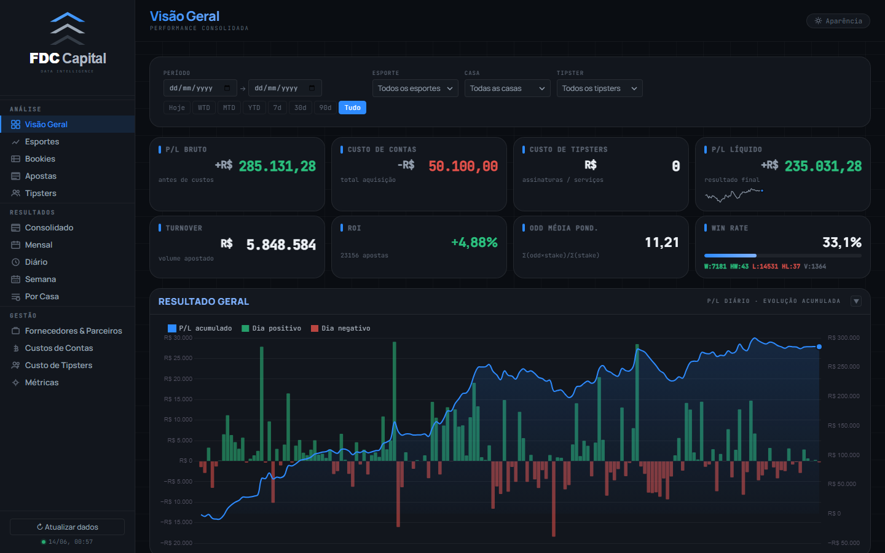

**Pontos fortes:**
- É a tela "cartão de visita" — precisa impressionar em 3 segundos e consegue
- O gráfico Resultado Geral (barras + linha acumulada) é o componente mais visualmente poderoso
- Os KPIs coloridos (verde/vermelho) no topo comunicam resultado imediatamente
- A barra de filtros bem posicionada não compete com o conteúdo
- **Referência de como gráfico + KPIs devem coexistir**

---

## PIORES TELAS

### ⚠️ 1. Custos de Contas (`custos.png`)
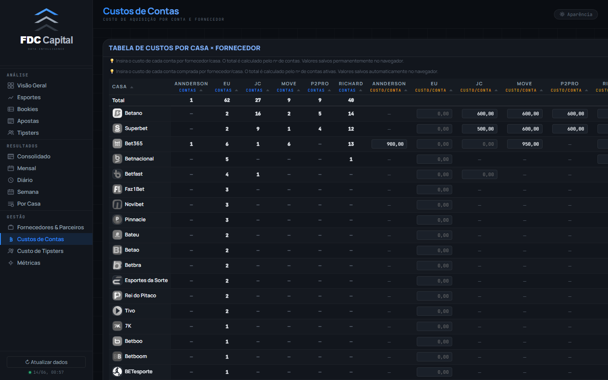

**Problemas:**
- **Tabela horizontal sem contexto**: abre direto numa grade densa sem nenhum KPI summary no topo. O padrão de toda outra página é: filtros → KPIs → conteúdo
- Colunas demais para a viewport (1440px) — já aparece scroll horizontal implícito
- Os inputs inline (`0,00`) têm visual diferente dos inputs de filtro do resto do sistema
- As duas linhas de instrução amarela (💡) acima da tabela parecem notas de rodapé, não UI
- O título "TABELA DE CUSTOS POR CASA × FORNECEDOR" está em uppercase bold direto na tela sem o padrão `.card-title` + `.card-hdr`
- **Parece uma planilha incorporada, não uma tela do dashboard**

---

### ⚠️ 2. Esportes (`sports.png`)
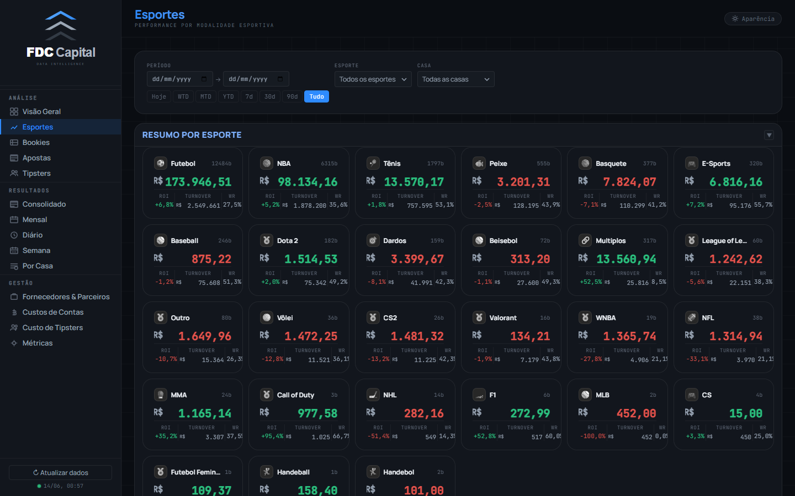

**Problemas:**
- Os cards `.stat-card` têm **130px de altura fixa** e **sem sparkline** — visualmente são de uma geração anterior aos cards de Bookies e Tipsters
- Grid com muitas colunas na viewport — os cards ficam pequenos demais (minmax muito agressivo)
- O P/L hero é menor (20px) e com peso diferente (700) vs. os 22px/600 dos `.tcard` e 28px/800 dos KPIs
- Informação no footer dos cards é truncada visualmente — "TURNOVER", "ROI", "WR" empilhados de forma apertada
- **É a tela que mais grita a inconsistência de 3 gerações de cards**

---

### ⚠️ 3. Custo de Tipsters (`custos_tipster.png`)
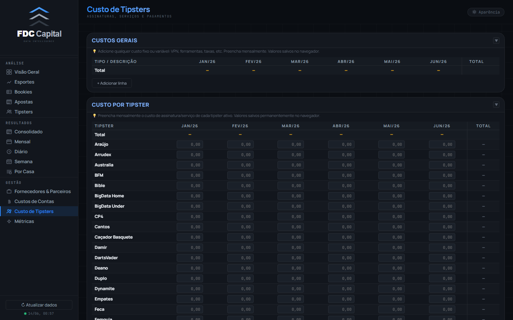

**Problemas:**
- Mesma ausência de KPIs summary no topo que Custos de Contas
- A seção "CUSTOS GERAIS" está quase vazia (sem dados) e ocupa muito espaço antes do conteúdo real
- Os inputs `0,00` em todas as células criam uma "neve visual" — padrão de formulário, não de dashboard
- A lista de tipsters é longa e sem nenhum mecanismo de agrupamento ou resumo visual
- **Melhor candidata a ter um redesign de estrutura (não só cosmético)**

---

## TELAS MAIS CONSISTENTES

### Família Calendário: Consolidado + Mensal + Semana
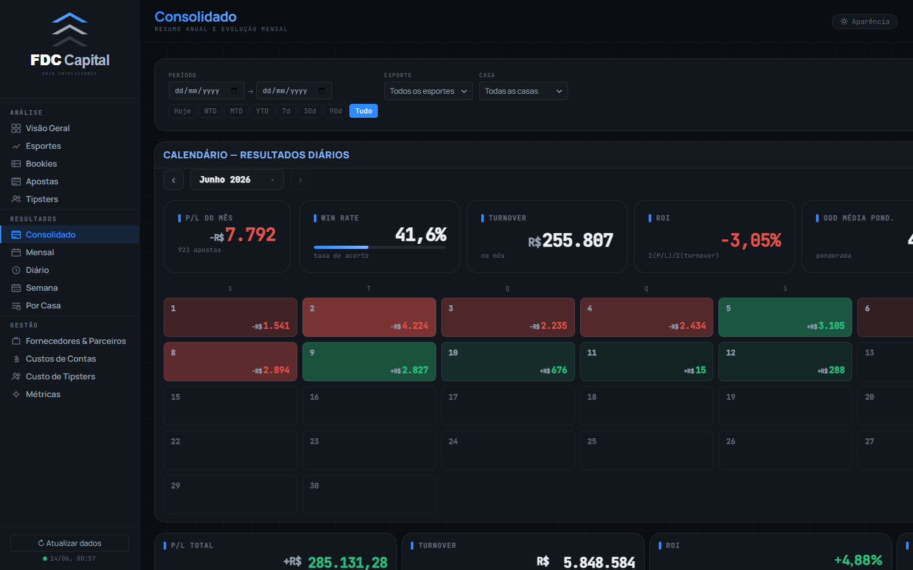
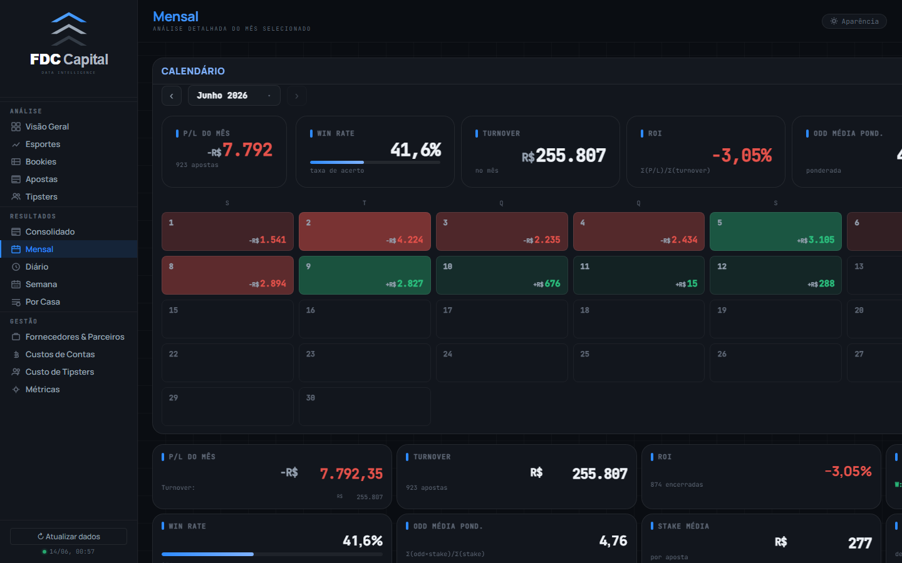
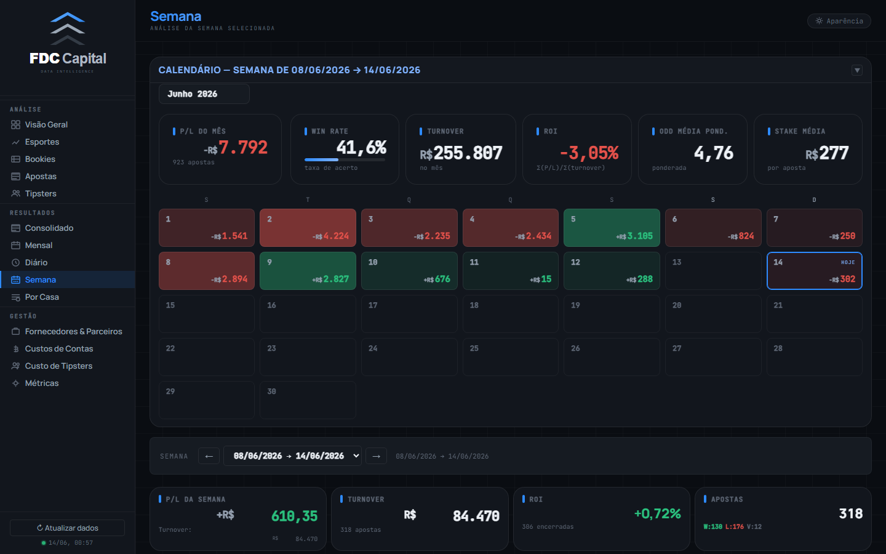

**Por quê são consistentes entre si:**
- As três telas usam exatamente o mesmo componente de calendário mensal (`mkCalendarHeatmap`)
- Os mini-cards acima do grid (P/L do Mês, Win Rate, Turnover, ROI, Odd Média) têm padding, fonte e hierarquia idênticos
- As células do calendário com coloração proporcional funcionam da mesma forma nas três
- A navegação de mês/semana está no mesmo posicionamento e com o mesmo visual
- Os KPI cards abaixo do calendário (na Mensal e Semana) seguem o padrão `.kpi` perfeitamente

**São a família mais coesa do dashboard inteiro.**

---

### Dupla Bookies + Tipsters
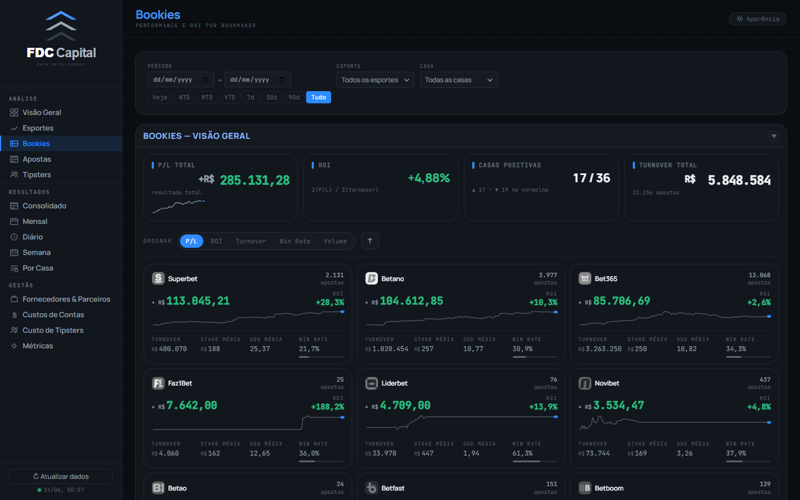
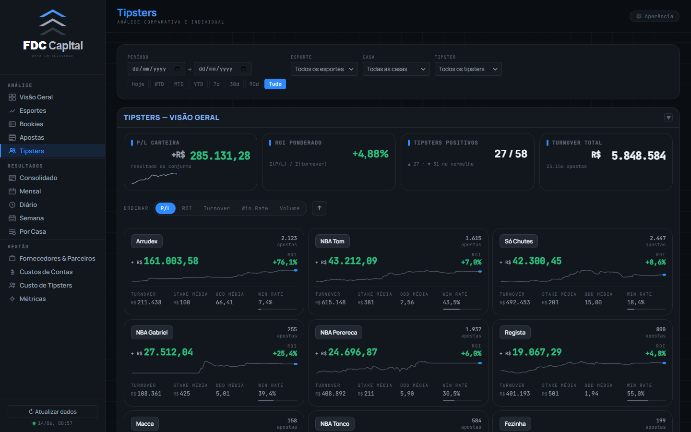

**Por quê são consistentes entre si:**
- Ambas usam `.tcard` com a mesma estrutura: nome → P/L hero → sparkline → footer de métricas
- O sort bar em cima dos cards tem o mesmo visual pill-toggle em ambas
- As sparklines têm a mesma altura e estilo nas duas abas
- Os badges de ROI têm mesmo estilo nas duas

**Problema apontado:** Esportes não pertence a esta família ainda.

---

## TELAS MAIS PROBLEMÁTICAS

### Ranking de problemas visuais

| Posição | Tela | Problema principal | Impacto TOC |
|---|---|---|---|
| 1 | **Esportes** | Cards de geração diferente de Bookies/Tipsters — 3 famílias na mesma seção de análise | 🔴 Alto |
| 2 | **Custos de Contas** | Sem padrão de layout dashboard — parece planilha | 🔴 Alto |
| 3 | **Fornecedores & Parceiros** | Cards de custo têm visual proprio, fora do sistema | 🟡 Médio |
| 4 | **Custo de Tipsters** | Mesma quebra estrutural dos Custos + formulário denso | 🟡 Médio |
| 5 | **Apostas** | KPI cards no topo com alturas irregulares (valor com 3 linhas vs 1) | 🟡 Médio |

---

## OBSERVAÇÕES TRANSVERSAIS (válidas para todas as telas)

### O que é consistente em TODAS as telas ✅
- Sidebar: 220px, logo, nav-groups em mono uppercase, active com borda azul esquerda
- Topbar: 68px, título gradient azul, sub-título mono uppercase, botão Aparência
- Paleta: dark base #0A0D12, azul #2E8BFF como único acento, verde/vermelho só em resultado
- Scrollbar fina com thumb steel
- Grid de fundo 44px (sutil mas presente)
- Fontes: Manrope para UI, JetBrains Mono para dados

### O que varia entre telas ⚠️
- **Altura dos KPI cards**: Visão Geral/Apostas têm KPIs com alturas irregulares; Diário/Mensal/Semana são uniformes
- **Família de card de entidade**: `.stat-card` (Esportes) vs `.tcard` (Bookies, Tipsters)
- **Presença de KPI summary**: todas as páginas de análise têm; páginas de Gestão não têm
- **Peso do P/L hero**: 700 em stat-card, 600 em tcard — nenhum usa 800 como o `.kpi-val`

---

## USO COMO REFERÊNCIA

Durante a implementação do design system, usar como **gabarito positivo**:
- Diário → referência de grid de KPIs uniformes
- Métricas → referência de seções colapsáveis e hierarquia de conteúdo
- Mensal → referência do componente calendário e mini-cards
- Por Casa (barras) → referência de componente visual único bem executado

E como **gabarito negativo** (o que precisa mudar):
- Esportes → migrar para `.tcard` (prioridade máxima)
- Custos de Contas → adicionar KPI summary + revisar estrutura
- Custo de Tipsters → revisar estrutura de layout
