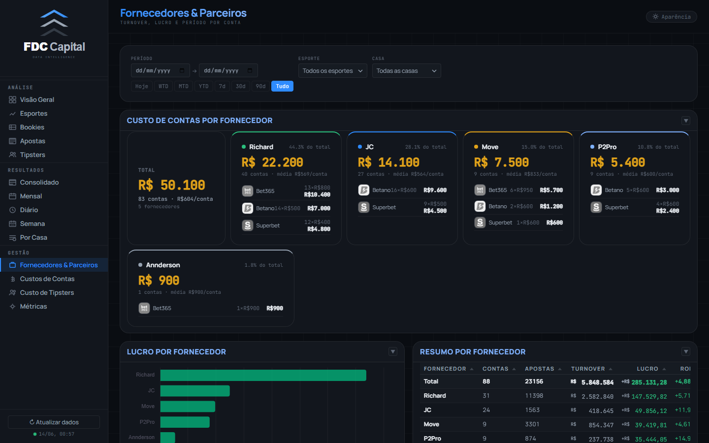
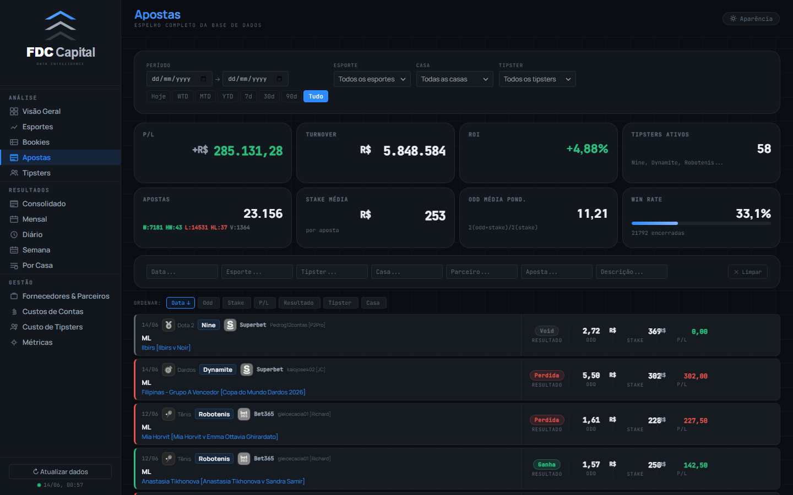

# UI Reference Board — FDC Capital Betting Dashboard
> Atualizado: 2026-06-14 (sessão 29) | Viewport: 1440×900 | Tema: dark compact
> Screenshots anteriores: sessão 28 (Fase 0). Screenshots atuais capturam Fases 1–5 implementadas.

Todas as imagens em: `docs/screenshots/`

---

## MELHORES TELAS

### 🥇 1. Diário (`diario.png`)

**Por quê é a melhor:**
- 8 KPIs em 2 fileiras de 4 — completamente uniformes em padding, peso tipográfico e hierarquia
- A tabela de tipsters do dia usa alinhamento perfeito (nome esquerda, números direita)
- Os bet-cards no rodapé têm a borda colorida de resultado funcionando com elegância
- Nenhum elemento "sobressai" errado — tudo no mesmo nível de atenção
- **É o padrão de referência para o que os KPI cards devem ser em todo o dashboard**

---

### 🥈 2. Métricas (`metrics.png`)

**Por quê é excelente:**
- Os KPI cards de MDD / EMDD / XMDD / P-Value no topo são cirúrgicos — sem adornos, só dado
- A semântica de cor está correta: vermelho = realizado, verde = favorável, branco = neutro
- As seções colapsáveis têm hierarquia clara: título azul → fórmula mono → exemplo verde → aviso vermelho
- O contraste das caixas de fórmula (background escuro, texto mono azul) é legível e elegante
- **Página de maior densidade informacional que ainda respira**

---

### 🥉 3. Por Casa — barras (`resultados_casa.png`)

**Por quê se destaca:**
- As barras horizontais com favicon + nome + barra proporcional + valor à direita são o componente mais original do dashboard
- A proporção é perfeita: favicon 24px alinhado ao nome, barra tomando ~70% da largura
- Os 4 KPIs no topo são consistentes com o restante do sistema
- Cor única (verde) para todas as barras positivas — sem ruído
- **Mostra que o dashboard tem capacidade para componentes únicos e sofisticados**

---

### 4. Visão Geral (`overview.png`)

**Pontos fortes:**
- É a tela "cartão de visita" — precisa impressionar em 3 segundos e consegue
- O gráfico Resultado Geral (barras + linha acumulada) é o componente mais visualmente poderoso
- Os KPIs coloridos (verde/vermelho) no topo comunicam resultado imediatamente
- A barra de filtros bem posicionada não compete com o conteúdo
- **Referência de como gráfico + KPIs devem coexistir**

---

## TELAS MELHORADAS (Fases 3–5)

### Esportes — antes vs agora (`sports.png`)

**O que mudou (Fase 3):**
- Migrado de `.stat-card` (130px fixo, sem sparkline) para `.tcard` — agora na mesma família visual de Bookies e Tipsters
- Sparkline real de 90 dias para cada esporte
- 4 KPIs de portfólio no topo (P/L · Turnover · ROI · Apostas)
- Sort bar com os mesmos 4 critérios (P/L · ROI · Turnover · Win Rate)
- Grid 3 colunas idêntico ao de Tipsters

**Status: consistente com Bookies e Tipsters** ✅

---

### Fornecedores & Parceiros (`parceiros.png`)

**O que mudou (Fase 4):**
- Faixa de 8 KPIs em 2 rows adicionada no topo (P/L dos Parceiros, Turnover, ROI, Apostas, Win Rate, Odd Média, Stake Média, Fornecedores Ativos)
- Agora segue o mesmo padrão de layout das páginas de análise

---

### Custos de Contas (`custos.png`)

**O que mudou (Fase 4):**
- Faixa de 4 KPIs adicionada no topo: Total de Custos · Custo Médio/Conta · Contas Ativas · Fornecedores
- KPIs atualizam em tempo real ao editar qualquer valor na tabela

---

### Custo de Tipsters (`custos_tipster.png`)

**O que mudou (Fase 4):**
- Faixa de 4 KPIs adicionada no topo: Total Geral · Custo Tipsters · Custos Gerais · Tipsters com Custo
- KPIs recalculados a cada save de input

---

## TELAS AINDA COM OPORTUNIDADES

### Apostas (`apostas.png`)

**Problemas remanescentes:**
- KPI cards no topo com alturas irregulares (valor com 3 linhas vs 1)
- Os bet-cards de scroll virtual têm estrutura própria — compacto intencional, mas pode melhorar

---

## TELAS MAIS CONSISTENTES

### Família Calendário: Consolidado + Mensal + Semana

**Por quê são consistentes entre si:**
- As três telas usam exatamente o mesmo componente de calendário mensal (`mkCalendarHeatmap`)
- Os mini-cards acima do grid (P/L do Mês, Win Rate, Turnover, ROI, Odd Média) têm padding, fonte e hierarquia idênticos
- Os KPI cards seguem o padrão `.kpi` perfeitamente
- **São a família mais coesa do dashboard inteiro.**

---

### Trinca Esportes + Bookies + Tipsters

**Por quê são consistentes entre si (pós Fase 3):**
- As três usam `.tcard` com a mesma estrutura: nome → P/L hero → sparkline → footer de métricas
- Sort bar com visual pill-toggle idêntico nas três
- Grid 3 colunas e 4 KPIs de portfólio no topo em todas

---

## OBSERVAÇÕES TRANSVERSAIS

### O que é consistente em TODAS as telas ✅
- Sidebar: 220px, logo, nav-groups em mono uppercase, active com borda azul esquerda
- Topbar: 44px, título gradient azul, sub-título mono uppercase, botão Aparência
- Paleta: dark base `#0A0D12`, azul `#2E8BFF` como único acento, verde/vermelho só em resultado
- Scrollbar fina com thumb steel
- Grid de fundo 44px (sutil mas presente)
- Fontes: Manrope para UI, JetBrains Mono para dados
- Tokens CSS: todos os arquivos JS e CSS usam tokens canônicos (`--ink`, `--pos`, `--neg`, `--accent`...) — zero aliases legados remanescentes (Fase 5)

### O que ainda varia ⚠️
- **Altura dos KPI cards**: Visão Geral/Apostas têm KPIs com alturas irregulares; Diário/Mensal/Semana são uniformes
- **Densidade dos cards de Gestão**: as tabelas de Custos são densas por natureza (formulário), diferente das telas de análise
